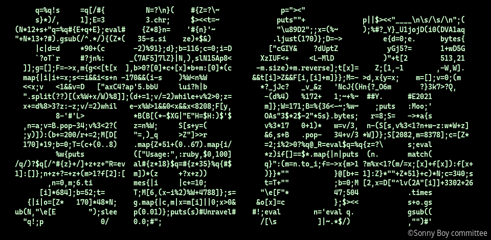

# A "nankai" program used in "Sonny Boy"

## What is this?

This is a program that was used as an insert to episode five of ["Sonny Boy"](https://anime.shochiku.co.jp/sonny-boy/), a Japanese anime television series.



[Demo movie](https://youtu.be/33r6NXbelJk)

The shape of the program is "難解" which means "difficult to solve" in [Kanji letters](https://en.wikipedia.org/wiki/Kanji).
The program, when executed, first shows the program itself, then does solve (or untie) itself into mutiple strings (not ones for programming).
Then, the strings are tied up to form a message "Solved", finally wiped out.
See the [movie](https://youtu.be/33r6NXbelJk).

This program demonstrates a supernatual ability in Sonny Boy, called "解く", which means "solve", "untie", or "decompose" in Japanese.

## How can I run it?

You can simply run the program with the Ruby interpreter as follows. You need to use a large terminal (180 x 40 at least).

```
$ ruby nankai.rb
```

## Is that all?

The program has many easter eggs. Can you find them yourself? See the ["decomposed"](decomposed/) directory if you can't.
